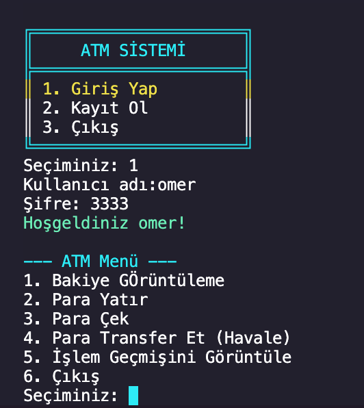
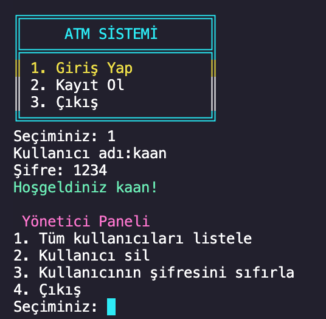
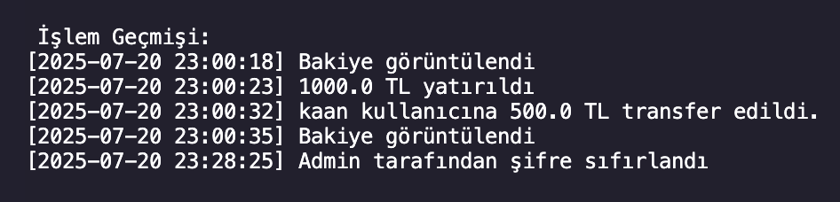

# 🏧 ATM Projesi (Terminal Tabanlı)

Bu proje, terminal üzerinden çalışan bir ATM simülasyon sistemidir. Python dili kullanılarak geliştirilmiştir. Kullanıcı ve yönetici panelleri, renkli terminal arayüzü ve işlem geçmişi loglama gibi işlevleri içerir.

## 🚀 Özellikler

- 👤 Kullanıcı kaydı ve girişi
- 🏦 Bakiye görüntüleme, para yatırma, para çekme
- 🔄 Para transferi (havale)
- 🕵️ Yönetici paneli (şifre sıfırlama, kullanıcı silme)
- 📝 Her kullanıcı için işlem geçmişi (log.txt)
- 🎨 Renkli terminal arayüzü (colorama modülü ile)

## 📁 Dosya Yapısı

```
ATM_Project/
├── README.md
├── atm.py
├── users.json
├── ...
└── screenshots/
    ├── atm-menu.png
    ├── atm-menu2.png
    └── atm-menu3.png


## 🖼️ Ekran Görüntüleri

Aşağıda örnek bir terminal arayüzü görüntüsü bulunmaktadır:





> Diğer ekran görüntüleri: giriş ekranı, kullanıcı paneli, admin paneli, işlem geçmişi vb.

## ⚙️ Kurulum

1. Python 3.10+ kurulu olduğundan emin olun.
2. Gerekli kütüphaneyi yükleyin:
   ```bash
   pip install colorama
   ```
3. Uygulamayı çalıştırın:
   ```bash
   python3 atm.py
   ```

## 🛠️ Kullanılan Teknolojiler

- Python
- JSON
- Colorama (renkli terminal çıktısı)

## 👨‍💻 Geliştirici

- [LinkedIn Profilim](https://www.linkedin.com/in/kaan-t%C3%BCre-535405188/)
- [GitHub Profilim](https://github.com/TureKaan)

